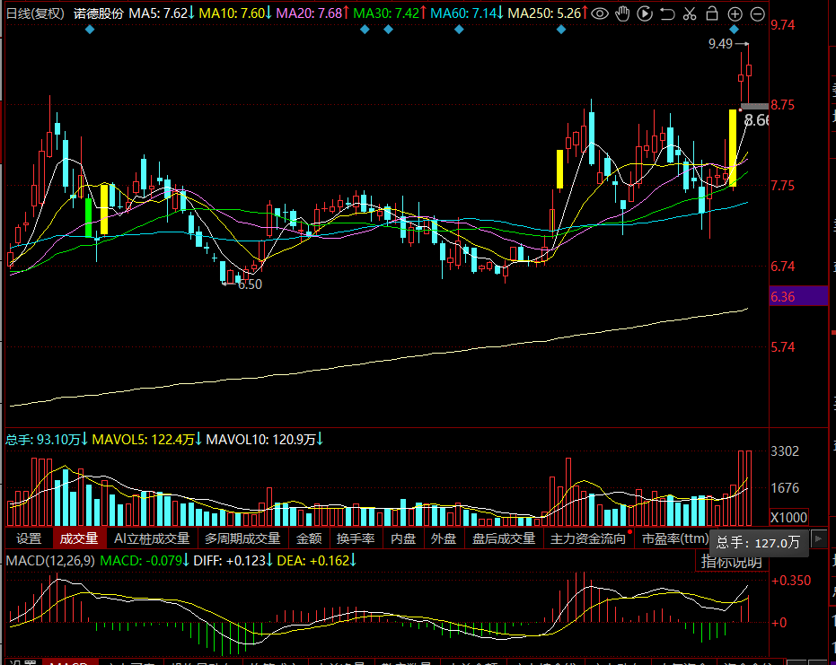

# 2026-04-01 盘前分析

**日期**：2026年4月1日（周三）| 今日为N盛龙上市第2个交易日

---

### 势（大盘环境）

- 大盘处于**震荡磨底**阶段，3月末深度调整后情绪偏谨慎
- 短期区间参考 **3800-4000点**，4月上旬无明显趋势性反转预期
- 进入财报密集披露期，市场风险偏好压制，资金从题材切换向**业绩确定性**迁移
- 外部扰动：地缘冲突+全球通胀预期，风险偏好整体偏低

---

### 术（今日操盘重心）

- **核心盯盘标的：N盛龙（001257）**
  - 昨日收盘 27.68 元（+253.96%），今日为第2个无涨跌幅限制交易日
  - **竞价决策框架**：
    - 高开 +10% 且封板 → 游资接力信号，可轻仓追
    - 平开/低开 → 首日高位套牢盘出逃，不参与
    - 高开后快速回落破昨日收盘价 → 止损离场逻辑确立

---

### 法（热点资金方向）

- **资源品/顺周期**：能源安全逻辑持续，钼等小金属顺势受益 → N盛龙次日延续性是重点观察对象
- **高股息蓝筹**：防御属性凸显，银行/消费类有配置资金介入
- **硬科技（AI/机器人/半导体）**：中长期逻辑强，但位置偏高，等回调
- **创新药**：近期抗跌，有避险资金流入

---

### 纪律评价

> 判断今日每条操作是「博弈概率」还是「幻想预期」：

- ✅ **博弈概率**：N盛龙竞价高开+10%封板入场 — 有量化触发条件、明确止损位，逻辑闭环
- ✅ **博弈概率**：破昨收 27.68 不参与 — 设防线即合格，非恐慌性决策
- ⚠️ **幻想预期**：「硬科技回调至支撑区再进」— 支撑区未量化，触发后仍无法执行
- ⚠️ **幻想预期**：「大盘放量突破4000再加仓题材」— 无仓位上限、无止损，触发后仍可能乱做

---

### 核心逻辑

今日核心押注 N盛龙二板延续性。大盘弱势背景下新股首日溢价极高，二板成功率依赖竞价资金堆砌。若竞价无量则资金已撤，全天空仓观望。

---

### 风险点

- **财报地雷季**：4月起业绩预告密集，持仓需排查基本面暴雷风险
- N盛龙高位密集成交区（23-27元）筹码极重，二板失败则快速回落空间大
- 大盘弱势背景下，题材股资金分散，难出连板龙效应
- 监管持续推进退市机制收紧，规避绩差小市值

---

### 明日计划（今日执行）

| 标的 | 触发条件 | 动作 | 纪律评判 |
|------|----------|------|----------|
| N盛龙 | 竞价高开 +10% 封住 | 仓位≤10%，止损昨收 27.68 | ✅ 博弈概率 |
| N盛龙 | 开盘后破昨收 27.68 | 不参与 | ✅ 博弈概率 |
| 硬科技回调标的 | 回调至具体支撑价位（待补） | 加入观察池，不急进 | ⚠️ 幻想预期，需补量化价位 |
| 其他题材 | 大盘放量突破 4000 | 再考虑加仓题材（无止损，待补） | ⚠️ 幻想预期，需补仓位+止损 |

**今日核心动作**：竞价前5分钟挂单量 > 昨日竞价量则轻仓进，否则全天空仓。

---

### 📋 输出规范（强制）

> 每次填写本模板，必须满足以下所有要求，否则视为无效分析：

| # | 字段约束 | 不合格示例 | 合格示例 |
|---|----------|------------|----------|
| 1 | **触发条件必须量化** | 「回调到支撑区」 | 「回调至 XX.XX 元前低/均线」 |
| 2 | **动作必须含仓位+止损** | 「轻仓跟进」 | 「仓位≤10%，止损 XX.XX 元」 |
| 3 | **纪律评判必须二选一** | 留空或写「合理」 | ✅博弈概率 或 ⚠️幻想预期（加理由） |
| 4 | **风险点必须对应到具体标的/价位** | 「高位筹码重」 | 「[标的] XX-XX 元密集区，破 XX.XX 即止损」 |
| 5 | **核心动作必须可被事后验证** | 「高警觉观察」 | 「竞价前5分钟挂单量 > 昨日竞价量则进，否则空仓」 |

**纪律评判定义**：
- ✅ **博弈概率**：有触发条件 + 止损位 + 预期收益比，即使亏损也是合格执行
- ⚠️ **幻想预期**：依赖「感觉会涨」「等企稳」「看情况」等模糊判断入场，无论结果如何都是纪律失格

---

*记录时间：2026-04-01 07:10*

---

## 盘后 · 操作评价

*评价时间：2026-04-01 07:47*

### 诺德股份 买入

| 字段 | 内容 |
|------|------|
| 标的 | 诺德股份 |
| 买入价 | 9.27 元 |
| 仓位 | 20% |
| 触发条件 | 锂电板块异动龙头 |
| 止损位 | MA5 = 8.54 元（动态上移中） |
| 止损比 | **7.9%**（(9.27-8.54)/9.27） |
| 底部涨幅 | 约 +42.6%（6.50→9.27） |

**策略框架**：隔日套利 / 博弈龙头加速

**纪律评判**：✅ **博弈概率**
- 止损MA5（8.54，动态上移），止损比7.9%，隔日套利框架内合理 ✅
- **42%涨幅耗时3.5个月（2025-12-18至今，50+交易日）**：缓涨筹码极度分散，无密集浮筹套牢区，启动逻辑成立 ✅
- **MACD零轴上、第一次金叉、加速突破**：启动信号清晰，非多次钝化，是趋势刚起步阶段 ✅
- 成交量93万 < MAVOL5 122万：缩量是已知风险，隔日套利博次日情绪，可接受

**情绪评判**：✅ **博弈概率**
- 有明确启动信号（MACD首次金叉+加速突破），入场是判断，不是跟风

**风险点（已知，需盯）**：
> - 次日若无量跟进或低开破MA5（8.54+），止损不可犹豫
> - 缩量日买入，次日开盘情绪是唯一验证节点
